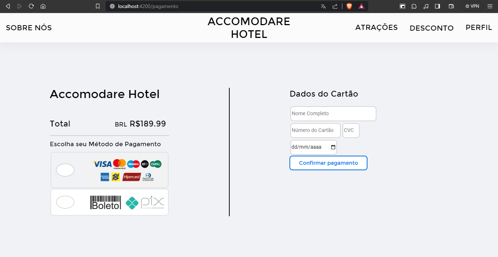

# Estrutura do projeto a ser utilizado na disciplina de ESS

## Acommodare Hotel

Bem-vindos ao Acommodare Hotel, esse é projeto de desenvolvimento que simula um projeto de site para fazer reservas
em um pseudo hotel que nós o batizamos de Accomodare Hotel. As funcionalidade vão desde checar as disponibilidades de hoteis, 
criar reservas, checar e usar descontos, página de usuário, sistema para checar disponibilidade de atrações nas redondezasa do 
hotel e sistema de avaliação sobre determinadas reservas.


### Atrações

Esta é a página de atrações onde é possível checar atrações de entretenimento nas redondezas do hotel.


### Atração

Na página de atração é possível checar as informações da atração como também checar avaliações sobre a mesma e também fazer a compra pré-planejada de uma determinada atração.





### Descontos

Na página de descontos é possível olhar todos os descontos disponíveis para atrações disponíveis.


## Como rodar o projeto

### Dependências

- Angular
- Node 
- npm

### Instalando dependências 
```
sudo apt install npm
sudo npm install -g @angular/cli
```

### Modificando a versão do Node
```
sudo npm install -g n
n 14.15
```

### Iniciando o projeto
```
cd web-app
sudo npm install
cd ..
cd server
sudo npm install
```
### Rodando o projeto
Iniciar o servidor
```
cd server
npm start
```
Iniciando o frontend
```
cd web-app
sudo npm install 
cd src
ng serve
```
